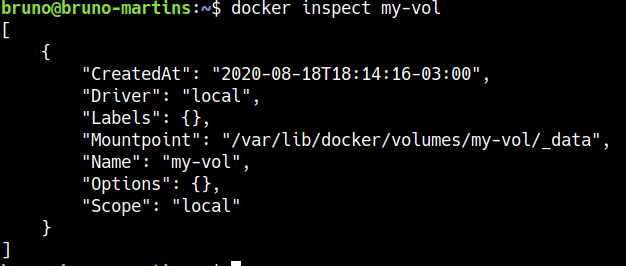

# Case Indicium Tech

Resolução da primeira etapa do processo seletivo da Indicium Tech. 

## Objetivo

Aplicação de ETL em inputs relacionados às negociações, setores, contatos e empresas para obter insumos para a preparação de dados referentes à negociação por setor, por mês e por contato.

## Configuração de Ambiente

### Via Ambiente Virtual

Será necessário ter instalado [Python 3](https://www.python.org/downloads/) e [pip](https://pip.pypa.io/en/stable/installing/). É indicada a utilização de um ambiente virtual, assim como a instalação dos arquivos presentes em `requirements.txt`.

Linux e MacOS
```
$ pip3 install virtualenv
$ virtualenv venv
$ source venv/bin/activate
$ pip install -r requirements.txt
$ python3 case.py
```

Windows
```
$ pip3 install virtualenv
$ virtualenv ..\venv
$ ..\venv\Scripts\activate
$ pip install -r requirements.txt
$ python3 case.py
```

Quando finalizado, basta desativar o ambiente virtual com:
```
$ deactivate
```

### Via Docker

Para executar via Docker, será necessário fazer a [instalação](https://docs.docker.com/get-docker/) do mesmo.

Após o download, execute o seguinte comando para baixar a imagem: 

```
$ docker pull costabrunom/indicium_case
```

Crie um volume para armazenar os arquivos do container na sua máquina

```
$ docker volume create my-vol
```

Execute a imagem criada

```
$ docker run -it --rm -v my-vol:/costabrunom/case_indicium costabrunom/indicium_case
```

Depois disso, os arquivos ficaram salvos na pasta referente ao volume criado. É possível conferir o diretório através do comando

```
$ docker inspect my-vol
```

Irá aparecer um resultado similar a este:



Para conferir os arquivos, bastar executar o comando

```
$ sudo ls <diretório_mountpoint>
``` 

## Observações

- Existem diferentes IDs de empresas que possuem o mesmo nome, mas setores diferentes. As linhas foram mantidas pelos diferentes IDs serem referenciados em outros arquivos.
- Existem diferentes IDs de contato que possuem todas as mesmas informações, com exceção das colunas employersId e contactsResponsible. As duplicatas foram removidas e essas duplicatas não referenciavam nenhum outro arquivo fornecido, totalizando 8 linhas removidas.
- Foram removidas, ao todo, 2 linhas por divergências de encoding. Uma no arquivo companies.tsv e outra em contacts.tsv.
